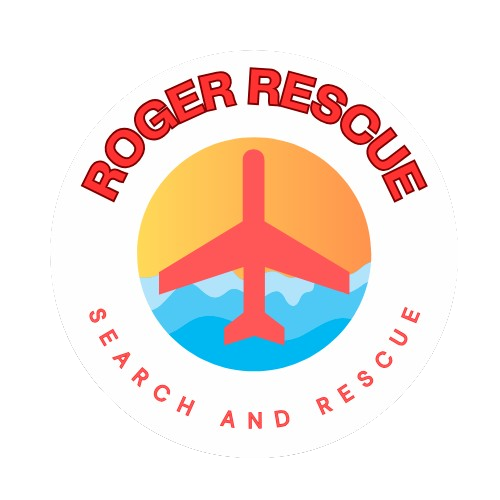
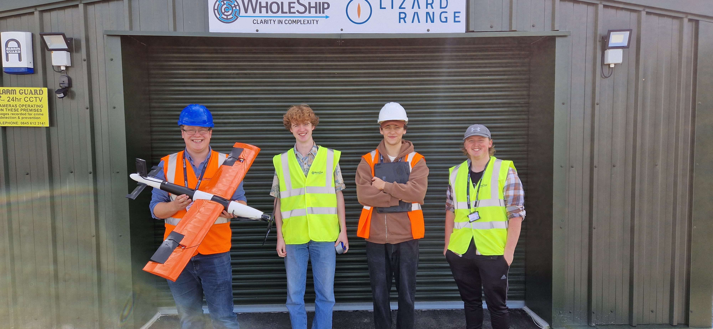

# Roger Rescue

## Outline
Roger rescue is a martatime search and rescue drone that was designed for my final group project of univeristy.

We developed a large fixed wing drone and an AI system that can detect persons in difficulty in the sea. Developoment is still ongoing and this page will be updated with its progress. Currently we have a functional AI system that can detect persons in the water at a considerable distance and an airframe that is undergoing trials at National Drone Hub in preddanack airfield. 

